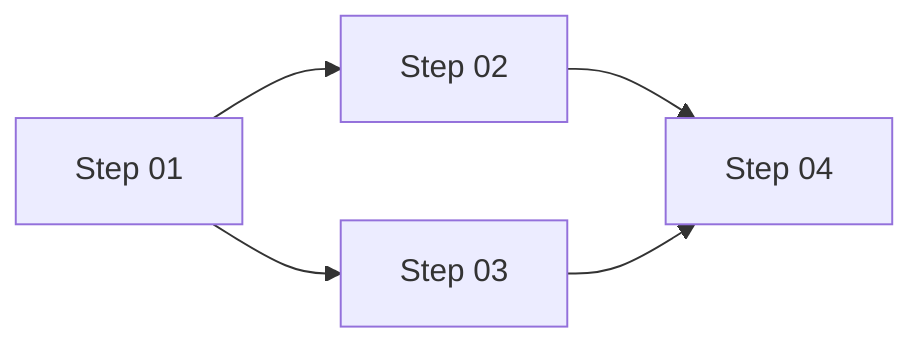

# {Arc plan title}

Every statement in this plan is exact. A deviation stops for approval.

## Objective

{What is delivered and why.}

## Not building

- {Exclusion and the reason it is out of scope.}

## Binding inputs

| Artifact | Lines | What it locks |
|---|---|---|
| `{path or identifier}` | {lines} | {Decision or constraint.} |

## Design decisions

1. **{Decision}:** {Rationale.}

## Open decisions

| Decision | Options | Recommendation | Owner | Consequence if different |
|---|---|---|---|---|
| {Decision} | {Options} | {Recommendation} | {Owner} | {How the plan changes.} |

## Prerequisites

- [ ] `{command}` — {Expected result before Step 01.}

## Dependency graph

Parallel: {Steps that share no files and no outputs, or `None`.}

## Steps

One step is one pull request.

### Step 01: {Title}

**Depends on:** {Step numbers or `None`}

**Context:** {The state of the repository when this step starts, as an executor with no history needs it.}

**Tasks:**

1. {Verb-first instruction.}
2. {Verb-first instruction. Open choice: {what is open}, because {reason}.}

**Rollback:** `{command}` — {What it restores.}

**Verification:**

- `{command}` — {Expected output.}

**Exit criteria:** {The resulting state, checkable without judgement.}

## Verification

| When | Command or procedure | Proves |
|---|---|---|
| Every step | `{command}` | {Property that must hold throughout.} |
| Completion | `{command}` | {Objective it proves.} |

## Risks

| Risk | Mitigation | Step |
|---|---|---|
| {Risk} | {Mitigation} | {Step number} |

## Progress log

This table is the only record of execution state.

| Step | Status | Branch | PR | Notes |
|---|---|---|---|---|
| 01 | pending | — | — | — |

Status is `pending`, `active`, `blocked`, `complete`, or `skipped`. A deviation awaiting approval is recorded in Notes
with the step `blocked`.
