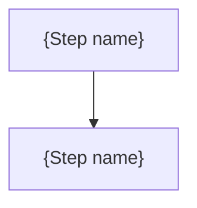

# {Arc plan title}

This plan is temporary and cannot amend canonical artifacts by itself. It may describe an outcome that differs from the
current specifications; each implementing change updates the corresponding Requirement, Design, or ADR through its
normal lifecycle. An unresolved conflict with a governing decision stops execution; a planned divergence from current
state does not.

All frontmatter fields are optional; a bare title is a valid plan. `status` is one of `draft`, `active`, or `complete`.
`relates-to` holds specful identifiers or paths, uninterpreted; plans may cite other plans and committed specful
artifacts, but Requirement, Design, and ADR artifacts never cite plans; like other path-valued fields, an entry goes
stale once the file it names moves to `plans/archive/`, accepted for an authoring convention. `issue` is one
tracker-agnostic string; a repository needing more lists them in prose.

## Objective

{The delivered outcome, one paragraph.}

## What this arc plan is and is not

This arc plan decomposes execution across change-sized deliverables. A deliverable gets its own change-plan file, with
`part-of` pointing back here, only when it needs standalone coordination; otherwise its step brief below is enough.
Binding inputs constrain only the decisions they actually settle; executors must not contradict or silently reopen them.
Implementation choices the inputs leave open are decided at the appropriate step and recorded in the changelog.

## Binding inputs

{Each binding authority, in prose, with what it locks. Cite accepted decisions and committed specifications; a proposed
or superseded ADR is context, not authority.}

## Dependency graph

<!-- Optional. If steps are strictly sequential, one sentence suffices;
delete the table and diagram. -->

| Step | Depends on (hard) | Soft edges | Parallel-eligible with |
|---|---|---|---|
| {Step} | {Step or none} | {Step or none} | {Step or none} |

The table is normative; a diagram below is illustration only, and the table wins where they disagree.

## Steps

### {Step name}

{Cold-start context brief: what an executor needs to know to start this step without reading the rest of the arc plan.}

- {Task}

Verification: {how this step's outcome is checked, or a reference to the step's change plan, whose Verification section
then applies.}

Exit criteria: {observable condition that marks this step done.}

## Verification

{How the integrated outcome is proven once the steps complete: the end-to-end, compatibility, or cross-step checks that
no single step's exit criteria cover.}

## Mutation rule

Reality-driven changes to this plan (split, insert, skip, reorder, abandon a step) are made in the plan and logged in
the changelog below. A change that touches a binding input is a stop-and-surface event for this plan's owner, not a
routine edit.

## Changelog

- {YYYY-MM-DD}: {Mutation or execution-time refinement, and why.}

## Completion

Graduate durable rationale to an ADR, then move this file out of the active set, to `plans/archive/` or by deletion, per
repository policy.
